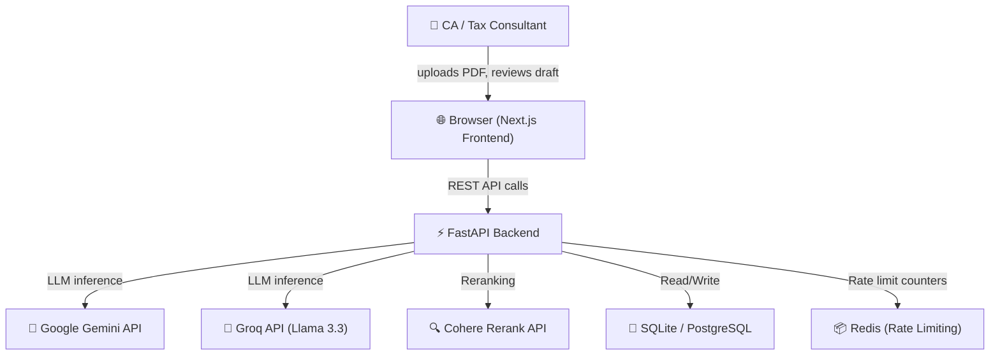
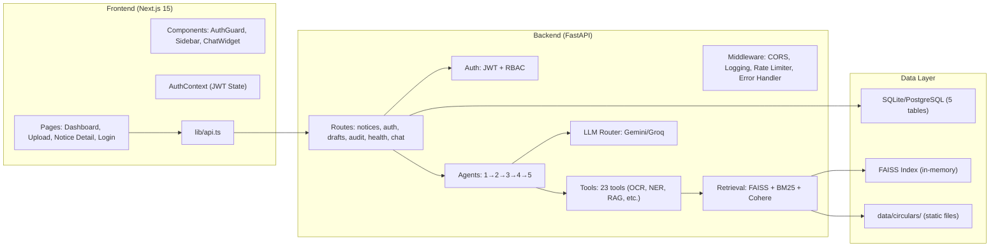
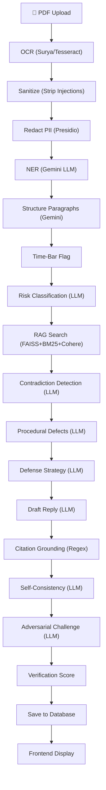
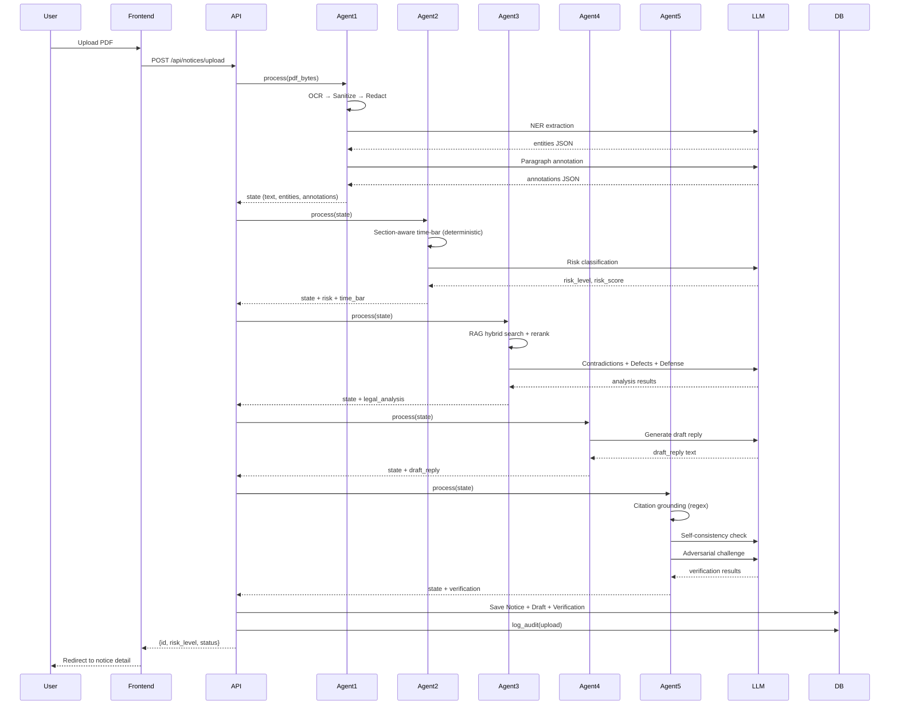
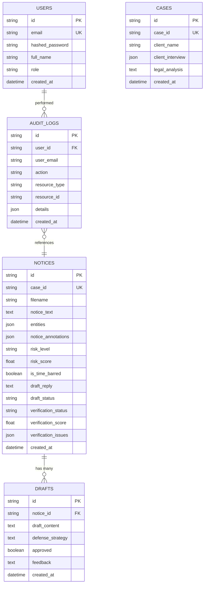

# TaxShield — Complete Technical & Conceptual Map

> **Version**: 2.0 — Generated 2026-03-20  
> **Audience**: Senior engineers, HOD, investors, auditors  
> **Codebase**: `Taxsheild/backend` (Python/FastAPI) + `Taxsheild/frontend` (Next.js 15)

---

# PHASE 1 — PROJECT IDENTITY & CORE PURPOSE

## What Is TaxShield?

**TaxShield is an AI-powered, multi-agent pipeline that ingests Indian GST tax notices as PDFs, performs OCR, entity extraction, risk classification, legal research via RAG, and generates professional draft replies — verified for hallucinations — end-to-end in under 60 seconds.**

## Problem & Target User

| Dimension | Detail |
|-----------|--------|
| **Problem** | When Indian businesses receive GST notices (Show Cause Notices, Demand Orders, Scrutiny Notices), responding requires a CA/tax lawyer who manually reads the notice, identifies sections, researches circulars, checks time-bar limitations, and drafts a reply. This costs ₹5,000–₹50,000 per notice and takes 3–14 days. Small businesses often miss deadlines, resulting in ex-parte orders. |
| **Target User** | Chartered Accountants (CAs), tax consultants, CA firms, and SMEs who handle GST compliance. Primary users are CAs who handle 20-200 notices per month. |
| **Value Proposition** | Reduces notice response time from days to minutes. Reduces cost from ₹5,000+ to near-zero per notice. Ensures no deadline is missed. Provides legally-grounded, section-aware draft replies. |

## Success Metrics

### Primary
1. **Draft Accuracy** — Correct section citations, no fabricated case law, correct time-bar calculations
2. **Time-to-Draft** — Under 60 seconds from PDF upload to draft reply
3. **Citation Grounding** — 100% of cited sections must exist in CGST Act
4. **User Acceptance Rate** — % of drafts approved without manual editing

### Secondary
1. **OCR Accuracy** — Correctly extract text from scanned Hindi/English notices
2. **Entity Extraction Precision** — GSTIN, DIN, section, amount, date extraction accuracy
3. **Risk Classification Accuracy** — Correct LOW/MEDIUM/HIGH classification
4. **InEx Verification Score** — Average verification score across all drafts

## Scope Boundary

**IN SCOPE:**
- GST notices under CGST Act 2017 (Sections 73, 74, 61, 65, 66, 67, 70, 71, 122, 125, 129, 130)
- Show Cause Notices (SCN), Demand Orders, Scrutiny Notices, Audit Notices
- English and Hindi language notices
- Draft reply generation (not final legal advice)
- Risk classification and time-bar analysis

**OUT OF SCOPE:**
- Income Tax, Customs, or other non-GST tax notices
- Filing of replies (only drafts, user files manually)
- Representation before tribunal or court
- GST return filing or compliance management
- Multi-state consolidated notices
- State GST (SGST) specific provisions (only CGST)

## Founding Assumptions

1. GST notices follow a somewhat standardized format (they do — CBIC templates)
2. CGST Act sections are stable enough to hardcode section-time-limit mappings
3. A CA will always review the AI draft before filing (human-in-the-loop is mandatory)
4. LLM-generated legal text, when grounded with RAG and verified, is sufficiently reliable for a first draft
5. OCR quality on Indian government notices is sufficient for text extraction
6. The GSTIN validation checksum algorithm is publicly known and stable
7. Time-bar calculations are deterministic given section + notice date + FY
8. Internet connectivity is available for LLM API calls (no offline mode)
9. Users have PDF versions of notices (not physical paper only)
10. The system does NOT need to handle privileged client-attorney communications

## Existential Risks

1. **Hallucinated case law** — If the LLM fabricates a Supreme Court citation and the CA files it, professional liability ensues. *Mitigated by Agent 5 (InEx Verifier).*
2. **Wrong time-bar calculation** — If the system incorrectly marks a valid notice as time-barred, the client ignores it and gets an ex-parte order. *Mitigated by section-aware time-bar in Agent 2.*
3. **LLM API downtime** — Gemini/Groq outage means zero functionality. *Partially mitigated by multi-provider LLM router.*
4. **PII leak** — GSTINs, PANs, and Aadhaar numbers sent to cloud LLMs. *Mitigated by Presidio PII redaction in Agent 1.*
5. **Regulatory change** — GST Act amendments could invalidate hardcoded section limits. *Requires manual update.*

---

# PHASE 2 — COMPLETE SYSTEM ARCHITECTURE

## Infrastructure Layer

| Component | Current State |
|-----------|--------------|
| **Hosting** | Local development (developer machine) |
| **Compute** | Standard CPU, no GPU required (OCR uses Surya/Tesseract, LLM calls are API-based) |
| **Database** | SQLite (dev) / PostgreSQL (production-ready via Alembic) |
| **Cache** | Redis (for rate limiting) |
| **File Storage** | In-memory (PDF bytes never persisted to disk) |
| **Deployment** | Not yet containerized; Docker-ready architecture |
| **Security** | JWT auth, bcrypt passwords, CORS *, rate limiting, input sanitization |

## Data Layer

### Data Sources

| Source | Type | Purpose |
|--------|------|---------|
| User-uploaded PDF | Input | GST notice document |
| `data/circulars/` | Static files | CBIC circulars for RAG retrieval |
| `data/case_laws/` | Static files | Case law documents for RAG |
| `app/tools/patterns.py` | Hardcoded | GSTIN regex, section lists, time limits |
| Gemini API | External API | LLM inference |
| Groq API | External API | LLM inference (Llama 3.3) |
| Cohere API | External API | Reranking search results |

### Database Schema (5 tables)

**`notices`** — Core table, one row per uploaded notice:
- `id` (String PK), `case_id`, `filename`, `notice_text`, `entities` (JSON)
- `notice_annotations` (JSON), `processing_status`, `risk_level`, `risk_score`, `risk_reasoning`
- `is_time_barred` (Boolean), `time_bar_detail` (JSON)
- `fy`, `section`, `notice_type`, `demand_amount`, `response_deadline`
- `draft_reply` (Text), `draft_status` (pending/draft_ready/approved/rejected)
- `verification_status`, `verification_score`, `verification_issues` (JSON), `accuracy_report` (JSON)
- `status`, `error_message`, `created_at`, `updated_at`

**`users`** — Authentication:
- `id` (String PK), `email` (unique index), `hashed_password`, `full_name`, `role`, `created_at`

**`drafts`** — Draft history:
- `id` (String PK), `notice_id`, `draft_content`, `defense_strategy`
- `supporting_documents` (JSON), `procedural_compliance`, `approved`, `feedback`, `created_at`, `updated_at`

**`cases`** — Case management:
- `id` (String PK), `case_id` (unique), `client_name`, `client_interview` (JSON)
- `legal_analysis`, `relevant_circulars` (JSON), `relevant_case_laws` (JSON), `status`, `created_at`, `updated_at`

**`audit_logs`** — Compliance trail:
- `id` (String PK), `user_id`, `user_email`, `user_role`
- `action` (upload/approve/reject/delete), `resource_type`, `resource_id`
- `details` (JSON), `ip_address`, `created_at`

### Data Flow

```
PDF Upload → [In-Memory Bytes] → Agent 1 (OCR → Sanitize → Redact → NER → Structure → Time-bar)
  → Agent 2 (Risk Classification + Final Time-bar)
  → Agent 3 (RAG Retrieval + Contradiction Detection + Defense Strategy)
  → Agent 4 (Draft Generation via LLM)
  → Agent 5 (InEx Verification: Citations + Consistency + Adversarial)
  → [Save to DB] → [API Response] → [Frontend Display]
```

### Sensitive Data Handling

1. PII fields (PAN, Aadhaar) are redacted by Presidio BEFORE any LLM sees the text
2. GSTIN is kept (needed for reply) but validated via checksum
3. PDF bytes are never persisted to disk — processed in-memory only
4. JWT tokens expire (configurable, default implementation)
5. Passwords hashed with bcrypt

## Application Layer

### API Architecture (FastAPI — REST)

| Method | Endpoint | Auth | Purpose |
|--------|----------|------|---------|
| `GET` | `/health` | None | Health check |
| `POST` | `/api/auth/register` | None | User registration |
| `POST` | `/api/auth/login` | None | JWT login |
| `GET` | `/api/auth/me` | JWT | Current user profile |
| `POST` | `/api/notices/upload` | JWT | Upload PDF → full pipeline |
| `GET` | `/api/notices` | JWT | List all notices |
| `GET` | `/api/notices/{id}` | JWT | Notice detail + draft + verification |
| `DELETE` | `/api/notices/{id}` | JWT (admin/ca) | DPDP Right to Erasure |
| `POST` | `/api/notices/{id}/approve` | JWT | Approve draft |
| `POST` | `/api/notices/{id}/reject` | JWT | Reject draft |
| `PUT` | `/api/notices/{id}/draft` | JWT | Edit draft text |
| `GET` | `/api/notifications` | None | Upcoming deadlines |
| `GET` | `/api/audit-logs` | JWT (admin) | Compliance trail |
| `POST` | `/api/chat` | None | Chat with AI assistant |

### Authentication & Authorization

- **JWT Bearer tokens** via `python-jose`
- **Password hashing** via `passlib[bcrypt]`
- **Dependency injection**: `get_current_user` (validates JWT), `require_role("admin", "ca")` (RBAC)
- **Frontend**: `AuthContext` (React Context) + `AuthGuard` component (redirect to `/login`)

### Middleware Stack

1. **CORS** — `allow_origins=["*"]` (development)
2. **Error Handler** — Catches unhandled exceptions, returns structured JSON errors
3. **Request Logging** — Logs method, path, status, duration for every request
4. **Rate Limiter** — In-memory sliding window (100 req/min default), periodic cleanup

### Logging

- Structured Python `logging` module
- Custom `app.logger` with formatted output
- Per-agent logging (Agent 1, 2, 3, 4, 5 each log their steps)
- Audit logging to database for compliance actions

## AI/ML Layer

### Models in Use

| Model | Provider | Purpose | When Used |
|-------|----------|---------|-----------|
| Gemini 2.0 Flash | Google | Fast inference | LOW risk notices |
| Gemini 2.0 Pro | Google | High-quality inference | HIGH risk notices |
| Llama 3.3 70B | Groq | Alternative/fallback | MEDIUM risk notices |

### LLM Router Logic ([router.py](file:///c:/Users/Abhis/.gemini/antigravity/playground/Taxsheild/backend/app/llm/router.py))

```python
if risk_level == "HIGH":   → Gemini Pro (highest quality)
if risk_level == "MEDIUM": → Groq Llama 3.3 (fast + good)
if risk_level == "LOW":    → Gemini Flash (fastest)
default:                   → Gemini Flash
```

### RAG Architecture

| Component | Implementation | File |
|-----------|---------------|------|
| **Embeddings** | `sentence-transformers/all-MiniLM-L6-v2` | `retrieval/embeddings.py` |
| **Vector Store** | FAISS (in-memory) | `retrieval/hybrid.py` |
| **Keyword Search** | BM25 (rank_bm25) | `retrieval/hybrid.py` |
| **Hybrid Fusion** | Reciprocal Rank Fusion (RRF) | `retrieval/hybrid.py` |
| **Reranker** | Cohere Rerank v3 | `retrieval/reranker.py` |
| **Ingestion** | Chunked document loading | `retrieval/ingestion.py` |

## Frontend Layer

### Technology
- Next.js 15 (App Router), React 19, TypeScript
- Vanilla CSS with CSS custom properties (design tokens)
- Inter + JetBrains Mono fonts

### Pages

| Route | Component | Auth | Purpose |
|-------|-----------|------|---------|
| `/` | `DashboardPage` | ✅ AuthGuard | Notice list with search/filter, risk stats |
| `/upload` | `UploadPage` | ✅ AuthGuard | PDF upload with drag-drop, real-time processing |
| `/notice/[id]` | `NoticeDetailPage` | ✅ AuthGuard | Split view: notice text + AI draft + InEx badge |
| `/login` | `LoginPage` | ❌ Public | Sign in / Create account toggle |

### Components

| Component | Purpose |
|-----------|---------|
| `Sidebar` | Navigation, user info, logout |
| `AuthGuard` | Redirect to `/login` if unauthenticated |
| `Providers` | Wraps AuthProvider |
| `AuthContext` | React Context for JWT + user state |
| `NotificationPanel` | Upcoming deadline alerts |
| `ChatWidget` | Floating AI chat bubble |
| `ChatPanel` | Full chat interface |

---

# PHASE 3 — EVERY PIPELINE IN THE SYSTEM

## PIPELINE 1: Notice Processing (Core Pipeline)

```
TRIGGER: POST /api/notices/upload (PDF file)
PURPOSE: Transform a raw GST notice PDF into a verified draft reply
```

### Step 1: Agent 1 — Document Processor
- **Input**: Raw PDF bytes
- **Process**: 6 sub-steps:
  1. **OCR**: Surya (local) → Tesseract fallback → Gemini Vision fallback. Extracts text from all pages.
  2. **Sanitize**: Regex-strips prompt injection patterns (ignore previous, system:, etc.)
  3. **PII Redact**: Presidio NER detects PAN, Aadhaar, phone numbers → replaces with `[REDACTED]`
  4. **NER**: Gemini LLM call extracts GSTIN, DIN, sections, notice_type, FY, demand_amount, dates. GSTIN validated via checksum.
  5. **Structure**: Gemini LLM annotates paragraphs as HEADER/FACTS/DEMAND/LEGAL_BASIS/RELIEF.
  6. **Time-bar Flag**: Calculates years elapsed from FY to notice date. Sets preliminary flag (NOT final decision).
- **Output**: `raw_text`, `entities`, `notice_annotations`, `time_bar_flag`
- **Error Handling**: If OCR fails, returns `processing_status: "failed"`. NER failure degrades gracefully with empty entities.
- **Latency**: 5–15 seconds (dominated by OCR + 2 LLM calls)

### Step 2: Agent 2 — Risk Router
- **Input**: entities, time_bar_flag from Agent 1
- **Process**:
  1. **Section-aware time-bar**: Uses `SECTION_TIME_LIMITS` map (Section 73 = 3yr, 74 = 5yr, etc.). This is the FINAL time-bar decision.
  2. **Risk classification**: Gemini LLM call with section, demand amount, notice type → outputs `risk_level` (LOW/MEDIUM/HIGH), `risk_score` (0-1), `risk_reasoning`.
  3. **Tool selection**: Maps risk level to tool set for Agent 3 (LOW = 2 tools, MEDIUM = 7 tools, HIGH = 9 tools).
- **Output**: `risk_level`, `risk_score`, `risk_reasoning`, `is_time_barred`, `time_bar_detail`, `available_tools`
- **Latency**: 2–5 seconds (1 LLM call)

### Step 3: Agent 3 — Legal Analyst
- **Input**: All state from Agents 1-2 + available_tools
- **Process**: Only runs for non-time-barred notices. Steps:
  1. **RAG Search**: Hybrid (BM25 + FAISS vector) search over circulars → Cohere rerank top 5
  2. **Contradiction Detection**: LLM analyzes notice for internal contradictions (section mismatch, computation errors, date inconsistencies)
  3. **Procedural Defect Analysis**: LLM checks for missing DIN, improper service, no hearing opportunity
  4. **Defense Strategy**: LLM builds defense strategy combining contradictions + defects + circulars
- **Output**: `retrieved_docs`, `contradictions`, `procedural_defects`, `defense_strategy`, `legal_analysis`
- **Latency**: 5–15 seconds (3 LLM calls + RAG search)

### Step 4: Agent 4 — Master Drafter
- **Input**: All state from Agents 1-3
- **Process**: Two paths:
  - **Time-barred**: Uses `TIME_BAR_PROMPT` → generates limitation-based defense reply
  - **Merit-based**: Uses `MERIT_PROMPT` → generates substantive defense using entities, risk assessment, circulars, contradictions, defense strategy
- **Output**: `draft_reply` (full text)
- **Latency**: 5–10 seconds (1 LLM call with large context)

### Step 5: Agent 5 — InEx Verifier
- **Input**: `draft_reply`, `entities`, `retrieved_docs`
- **Process**: 3-stage verification:
  1. **Citation Grounding** (weight 0.4): Regex finds all `Section X` references → checks against known CGST sections list + retrieved docs. Flags fabricated case law patterns.
  2. **Self-Consistency** (weight 0.3): LLM extracts key claims → checks for internal contradictions (e.g., "liable under Section 73" vs "not liable under Section 73").
  3. **Adversarial Challenge** (weight 0.3): Separate LLM call as GST officer devil's advocate → identifies weaknesses, unsupported claims, legal gaps.
- **Output**: `verification_score` (0-1), `verification_status` (passed/needs_review/failed), `verification_issues` (list), `accuracy_report`
- **Scoring**: `score ≥ 0.8 → passed`, `0.6 ≤ score < 0.8 → needs_review`, `score < 0.6 → failed`
- **Latency**: 3–8 seconds (2 LLM calls)

### Total Pipeline Latency: 20–53 seconds typical

### Failure Mode
- If any agent fails, the notice is saved with `status: "error"` and `error_message` containing the failure details
- Partial results are NOT saved — either the full pipeline completes or it fails entirely
- HTTP 500 returned to client

## PIPELINE 2: Authentication

```
TRIGGER: POST /api/auth/register or POST /api/auth/login
PURPOSE: Create user account or issue JWT token
```

- **Register**: Validate email uniqueness → bcrypt hash password → create User row → return JWT
- **Login**: Find user by email → bcrypt verify password → return JWT + user profile
- **JWT Structure**: `{"sub": user_id, "email": email, "exp": expiry}` signed with HS256

## PIPELINE 3: Draft Review

```
TRIGGER: POST /api/notices/{id}/approve or /reject
PURPOSE: Human-in-the-loop approval/rejection with audit trail
```

- Find notice → validate draft exists → update `draft_status` → create audit log entry → commit

## PIPELINE 4: Audit Trail

```
TRIGGER: Any protected action (upload, delete, approve, reject)
PURPOSE: DPDP Act 2023 compliance — who did what, when
```

- Route handler calls `log_audit(db, action, resource_type, resource_id, user, details)`
- Creates `AuditLog` row with user info, action, timestamp, and JSON details
- Admin queries via `GET /api/audit-logs?action=upload&limit=100`

## PIPELINE 5: Notification

```
TRIGGER: GET /api/notifications
PURPOSE: Surface upcoming response deadlines
```

- Queries all notices with `response_deadline` set
- Parses dates, calculates days remaining
- Flags overdue (red), due within 7 days (amber), upcoming (yellow)

---

# PHASE 4 — DATA STRUCTURES & SCHEMAS

## PipelineState (LangGraph State — [state.py](file:///c:/Users/Abhis/.gemini/antigravity/playground/Taxsheild/backend/app/agents/state.py))

```python
class PipelineState(TypedDict):
    # Agent 1 outputs
    case_id: str                    # UUID for this processing run
    pdf_bytes: bytes                # Raw PDF input
    raw_text: str                   # OCR-extracted text
    entities: dict                  # {GSTIN, DIN, SECTIONS, llm_extracted: {notice_type, fy, ...}}
    notice_annotations: list        # [{paragraph, role, summary}, ...]
    processing_status: str          # "complete" | "failed"
    
    # Agent 2 outputs
    risk_level: str                 # "LOW" | "MEDIUM" | "HIGH"
    risk_score: float               # 0.0–1.0
    risk_reasoning: str             # LLM explanation
    is_time_barred: bool
    time_bar_detail: dict           # {is_time_barred, section, time_limit, years_elapsed, ...}
    available_tools: list           # Tool names for Agent 3
    
    # Agent 3 outputs
    retrieved_docs: list            # RAG search results
    contradictions: list            # Detected contradictions
    procedural_defects: list        # Procedural issues found
    defense_strategy: str           # LLM-built defense
    legal_analysis: str             # Full analysis text
    interview_data: dict            # Client interview Q&A
    client_interview: dict          # Structured client responses
    
    # Agent 4 outputs
    draft_reply: str                # The generated reply text
    current_agent: str              # "agent1"|"agent2"|"agent3"|"agent4"|"agent5"
    
    # Agent 5 outputs (InEx)
    verification_score: float       # 0.0–1.0
    verification_status: str        # "passed"|"needs_review"|"failed"
    verification_issues: list       # [{severity, stage, description, suggestion}, ...]
```

## API Response Schemas

### Upload Response
```json
{
  "id": "uuid",
  "case_id": "filename.pdf",
  "risk_level": "LOW|MEDIUM|HIGH",
  "status": "processed|error",
  "draft_status": "draft_ready"
}
```

### Notice Detail Response
```json
{
  "id": "uuid", "case_id": "...", "filename": "...",
  "notice_text": "...", "entities": {...},
  "risk_level": "...", "risk_score": 0.0, "is_time_barred": false,
  "fy": "2022-23", "section": "73", "notice_type": "SCN",
  "demand_amount": 50000.0,
  "draft_reply": "...", "draft_status": "draft_ready",
  "verification_status": "passed", "verification_score": 0.87,
  "verification_issues": [...], "accuracy_report": {...},
  "status": "processed", "created_at": "..."
}
```

## Frontend TypeScript Interfaces

```typescript
interface Notice {
  id: string; case_id: string; risk_level: string;
  notice_type?: string; fy?: string; section?: string;
  demand_amount?: number; status: string; draft_status: string;
  created_at: string;
}

interface NoticeDetail extends Notice {
  filename: string; notice_text: string; entities: Record<string, any>;
  risk_score: number; is_time_barred: boolean;
  draft_reply: string;
  verification_status?: string; verification_score?: number;
  verification_issues?: VerificationIssue[]; accuracy_report?: Record<string, any>;
}
```

---

# PHASE 5 — AI/AGENT ARCHITECTURE DEEP DIVE

## Agent Orchestration (LangGraph)

```
START → agent1_node → agent2_node → agent3_node → agent4_node → agent5_node → END
```

Linear pipeline (no conditional branching in graph — Agent 3 handles time-bar skip internally).

### Agent 1: Document Processor
- **Role**: "I extract and structure. I never interpret."
- **Tools**: OCR engine, input sanitizer, PII redactor, NER extractor, notice structurer, time-bar calculator
- **LLM Calls**: 2 (NER extraction, paragraph annotation)
- **Decision Logic**: Always runs. No conditions.

### Agent 2: Risk Router
- **Role**: "I classify risk and decide time-bar. I route tools."
- **Tools**: Time-bar calculator (deterministic), LLM for risk classification
- **LLM Calls**: 1 (risk classification)
- **Decision Logic**: Section-aware time-bar is deterministic (no LLM). Risk classification uses LLM.
- **Critical Constraint**: Time-bar defaulting to strictest limit (3 years) if section unknown — prevents false dismissal.

### Agent 3: Legal Analyst
- **Role**: "I research and find weaknesses in the notice."
- **Tools**: RAG search (hybrid BM25+FAISS), Cohere reranker, contradiction detector, procedural defect analyzer, defense strategy builder
- **LLM Calls**: 3 (contradictions, procedural defects, defense strategy)
- **Decision Logic**: Skips RAG + analysis for time-barred notices (only basic search).
- **Tool Availability**: Controlled by Agent 2's risk-based tool set.

### Agent 4: Master Drafter
- **Role**: "I write the reply. I never fabricate citations."
- **Tools**: LLM with full context
- **LLM Calls**: 1
- **Decision Logic**: Selects TIME_BAR_PROMPT vs MERIT_PROMPT based on `is_time_barred`.
- **Critical Constraint**: Prompt explicitly says "Do NOT fabricate case law citations — only cite sections of the Act."

### Agent 5: InEx Verifier
- **Role**: "I audit the draft for hallucinations, fabrications, and weaknesses."
- **Tools**: Regex citation scanner, known CGST section list, LLM (claim extraction + adversarial challenge)
- **LLM Calls**: 2 (consistency check, adversarial challenge)
- **Decision Logic**: Always runs. Outputs score that determines badge color on frontend.

## Prompt Architecture

### NER Extraction Prompt ([notice_ner.py](file:///c:/Users/Abhis/.gemini/antigravity/playground/Taxsheild/backend/app/tools/notice_ner.py))
Extracts GSTIN, DIN, sections, notice_type, financial_year, notice_date, demand_amount, response_deadline. Returns JSON.

### Risk Classification Prompt (Agent 2)
Classifies based on section (73 vs 74), demand amount, notice type, time-bar status. Returns JSON with risk_level, risk_score, risk_reasoning.

### Contradiction Detection Prompt (Agent 3)
Identifies section mismatches, computation errors, date inconsistencies, factual errors, missing mandatory elements. Returns JSON array.

### Procedural Defect Prompt (Agent 3)
Checks for missing DIN, improper service, no personal hearing opportunity, wrong jurisdiction, unsigned orders.

### Draft Reply Prompts (Agent 4)
Two variants: TIME_BAR_PROMPT (limitation defense) and MERIT_PROMPT (substantive defense). Both include notice text, entities, sections, amounts, dates, and circulars.

### InEx Prompts (Agent 5)
Claim extraction prompt → returns numbered claims list. Adversarial prompt → GST officer identifies weaknesses.

## Tool Inventory (23 tools in `app/tools/`)

| Tool | Purpose |
|------|---------|
| `ocr.py` | Multi-engine OCR (Surya → Tesseract → Gemini Vision) |
| `input_sanitizer.py` | Strips prompt injection patterns |
| `redaction.py` | Presidio-based PII redaction |
| `notice_ner.py` | LLM-based entity extraction + GSTIN validation |
| `notice_structurer.py` | Paragraph role annotation |
| `timebar.py` | Time-bar calculation (section-aware) |
| `patterns.py` | Regex patterns, GSTIN format, section lists |
| `search_circulars.py` | CBIC circular search |
| `search_case_laws.py` | Case law search |
| `case_law_summarizer.py` | Summarize case law for context |
| `contradiction_detector.py` | LLM contradiction analysis |
| `procedural_defects.py` | LLM procedural defect check |
| `defense_builder.py` | LLM defense strategy |
| `din_verifier.py` | Document Identification Number verification |
| `citation_validator.py` | Validate legal citations |
| `interest_calculator.py` | GST interest computation |
| `pre_deposit.py` | Pre-deposit requirement calculator |
| `statutory_forms.py` | GST form identification |
| `story_scorer.py` | LLM story strength assessment |
| `templates.py` | Reply template selection |
| `interview.py` | Client interview Q&A |
| `document_request.py` | Request additional documents |

---

# PHASE 6 — ARCHITECTURE DECISIONS

| Decision | Chosen | Alternatives Considered | Rationale |
|----------|--------|------------------------|-----------|
| **LangGraph for orchestration** | LangGraph (linear StateGraph) | CrewAI, AutoGen, custom chains | Built on LangChain ecosystem; TypedDict state passing; simple linear pipeline matches domain needs |
| **Gemini + Groq dual LLM** | Gemini Flash/Pro + Groq Llama 3.3 | OpenAI GPT-4, Claude, single provider | Cost optimization (Flash for low-risk), Groq for speed (Llama 3.3 free tier), no single-vendor lock-in |
| **SQLite → PostgreSQL** | SQLite dev / PostgreSQL prod | MongoDB, Supabase | SQLAlchemy async works with both; SQLite for zero-config dev; PostgreSQL for ACID + production |
| **FAISS for vector store** | FAISS (in-memory) | PGVector, Pinecone, ChromaDB | Zero infrastructure for dev; fast; sufficient for ~1000 circular/case law documents |
| **Presidio for PII** | Microsoft Presidio | Custom regex, Amazon Comprehend | Open-source, NER-based (not just regex), supports Indian PII patterns |
| **Surya for OCR** | Surya (local) with fallbacks | Google Document AI, AWS Textract | Privacy-safe (no cloud upload), free, supports Hindi |
| **JWT auth (not OAuth)** | python-jose JWT | Auth0, Firebase Auth, OAuth2 | Simple for MVP; no external dependency; CA firms don't need SSO yet |
| **Next.js App Router** | Next.js 15 | React SPA, Vue, Svelte | Server components potential; file-based routing; industry standard |
| **Vanilla CSS over Tailwind** | CSS custom properties | Tailwind, styled-components | Full control; design tokens; no build dependency; smaller bundle |
| **InEx as Agent 5** | Separate verification agent | Inline checks in Agent 4, post-processing hook | Clean separation of concerns; can evolve independently; doesn't slow down drafting |

---

# PHASE 7 — DEPENDENCIES

## Python Dependencies (Backend)

| Package | Version | Purpose | Criticality |
|---------|---------|---------|-------------|
| `fastapi` | 0.109.0 | Web framework | 🔴 Critical — entire API |
| `uvicorn` | 0.27.0 | ASGI server | 🔴 Critical — runs the app |
| `langgraph` | ≥0.0.40 | Agent orchestration | 🔴 Critical — pipeline backbone |
| `langchain` | ≥0.1.0 | LLM abstraction | 🔴 Critical — LLM calls |
| `langchain-groq` | ≥0.1.0 | Groq LLM client | 🟡 Medium — one of three LLM providers |
| `google-generativeai` | ≥0.8.0 | Gemini LLM client | 🔴 Critical — primary LLM |
| `groq` | ≥0.4.0 | Groq direct client | 🟡 Medium — Llama 3.3 access |
| `sqlalchemy` (async) | — | ORM + async DB | 🔴 Critical — all data persistence |
| `aiosqlite` | ≥0.20.0 | Async SQLite driver | 🟡 Dev only |
| `asyncpg` | ≥0.29.0 | Async PostgreSQL driver | 🟡 Production only |
| `alembic` | ≥1.13.0 | DB migrations | 🟡 Medium — schema management |
| `sentence-transformers` | 2.3.1 | Embedding model | 🟡 Medium — RAG |
| `faiss-cpu` | — | Vector similarity search | 🟡 Medium — RAG |
| `rank-bm25` | 0.2.2 | BM25 keyword search | 🟢 Low — fallback search |
| `cohere` | ≥5.0.0 | Reranker API | 🟡 Medium — improves RAG quality |
| `pypdf` | ≥3.0.0 | PDF parsing | 🟡 Medium — text extraction |
| `PyMuPDF` | ≥1.23.0 | Advanced PDF parsing | 🟡 Medium — complex PDFs |
| `surya-ocr` | ≥0.8.0 | Local OCR engine | 🟡 Medium — primary OCR |
| `pytesseract` | ≥0.3.10 | Tesseract OCR fallback | 🟢 Low — OCR fallback |
| `presidio-analyzer` | ≥2.2.0 | PII detection | 🔴 Critical — privacy compliance |
| `presidio-anonymizer` | ≥2.2.0 | PII redaction | 🔴 Critical — privacy compliance |
| `python-jose` | ≥3.3.0 | JWT tokens | 🔴 Critical — authentication |
| `passlib[bcrypt]` | ≥1.7.4 | Password hashing | 🔴 Critical — auth security |
| `pydantic-settings` | ≥2.0.0 | Config management | 🟡 Medium — env vars |
| `jinja2` | ≥3.0.0 | Prompt templates | 🟢 Low — template rendering |

## Frontend Dependencies
- Next.js 15, React 19, TypeScript
- `lucide-react` (icons)
- No other significant dependencies

## External APIs

| API | Cost | Rate Limit | Fallback |
|-----|------|------------|----------|
| **Gemini API** | Free tier / pay-per-token | 60 RPM (free) | Groq Llama 3.3 |
| **Groq API** | Free tier | 30 RPM | Gemini Flash |
| **Cohere Rerank** | Free tier (1000/mo) | 100 RPM | Skip reranking, use raw RRF scores |

---

# PHASE 8 — KNOWN ISSUES, GAPS & FUTURE WORK

## Currently Not Working / Suboptimal

1. **RAG knowledge base is empty** — `data/circulars/` directory has no documents. Agent 3's RAG search returns empty results. This is the single biggest gap — the system works mechanically but the legal grounding is hollow without real CBIC circulars.
2. **Pyre2 lint false positives** — IDE shows "Could not find import" for all Python packages because the venv is not configured as a search root in the editor. These are false alarms — all imports work at runtime.
3. **CORS is `*`** — Fine for development, must be restricted for production.
4. **JWT expiry not configurable** — Hardcoded or very large default. Should have configurable token TTL.
5. **No email verification** — Registration accepts any email string without verification.

## Technical Debt

1. **No database indexes** — Queries will slow at scale. Need indexes on `notices.case_id`, `notices.status`, `audit_logs.created_at`.
2. **Synchronous Alembic stamp** — Current SQLite DB was stamped at head, so `alembic upgrade head` won't replay the initial schema. Fresh installs need `alembic upgrade head`.
3. **Unused tools** — Some tools in `app/tools/` (interview, document_request, pre_deposit) are defined but not wired into Agent 3's logic.
4. **No pagination** — `GET /api/notices` returns ALL notices. Will break at 10k+ rows.
5. **In-memory rate limiter** — Resets on server restart. Should use Redis for persistence.

## Scaling Constraints

| Scale | Bottleneck | Fix Needed |
|-------|-----------|------------|
| **10x** (200 notices/day) | LLM API rate limits | Queue system (Celery/RQ), API key pooling |
| **100x** (2000 notices/day) | SQLite contention, FAISS memory, single server | PostgreSQL, PGVector for embeddings, multi-worker deployment, Redis job queue |
| **1000x** (20k notices/day) | Everything | Kubernetes, model caching, batch processing, dedicated GPU for OCR |

## Roadmap (Not Yet Built)

1. **Docker Compose** — One-command deployment
2. **CI/CD** — GitHub Actions for tests + build
3. **MFA (TOTP)** — Google Authenticator support
4. **Batch upload** — Process multiple PDFs at once
5. **Draft comparison** — Show diff between AI draft and human-edited version
6. **Analytics dashboard** — Risk distribution, processing time trends, approval rates
7. **Webhook notifications** — Alert when processing completes
8. **Model A/B testing** — Compare Gemini vs Groq output quality
9. **Fine-tuned model** — Train on approved drafts for better quality

---

# PHASE 9 — VISUAL DOCUMENTATION

## 1. System Context Diagram



## 2. Container Diagram



## 3. Data Flow Diagram



## 4. Sequence Diagram (Upload Flow)



## 5. Entity Relationship Diagram



---

# PHASE 10 — MASTER OVERVIEW

## Executive Summary

**TaxShield** is an AI-powered multi-agent system that automates GST tax notice responses for Indian CAs and businesses. It takes a PDF notice, runs it through a 5-agent LangGraph pipeline (OCR → Risk → Legal Analysis → Drafting → Hallucination Verification), and produces a professional draft reply in under 60 seconds.

**Current status**: Functionally complete with 80 passing tests. Frontend and backend fully integrated. Auth, RBAC, audit logging, and InEx verification all operational. PostgreSQL migration path ready via Alembic.

**Key risk**: RAG knowledge base is empty — the system works mechanically but needs real CBIC circulars for legally-grounded outputs.

## Tech Stack Summary

| Layer | Technology |
|-------|-----------|
| **Backend** | Python 3.11, FastAPI, SQLAlchemy (async), LangGraph |
| **Frontend** | Next.js 15, React 19, TypeScript, Vanilla CSS |
| **Database** | SQLite (dev) / PostgreSQL (prod), Alembic migrations |
| **AI** | Gemini 2.0 Flash/Pro, Groq Llama 3.3 70B, sentence-transformers |
| **Search** | FAISS + BM25 hybrid, Cohere Rerank v3 |
| **Auth** | JWT (python-jose), bcrypt (passlib) |
| **Privacy** | Presidio PII redaction, Surya local OCR |

## Operational Overview

### Run Locally
```bash
# Backend
cd backend
pip install -r requirements.txt
cp .env.example .env  # Add API keys
uvicorn app.main:app --reload --port 8000

# Frontend
cd frontend
npm install
npm run dev  # → localhost:3000
```

### Deploy to Production
1. Set `DATABASE_URL=postgresql://...` in `.env`
2. Run `alembic upgrade head`
3. Set `DEBUG=false`, set real `JWT_SECRET_KEY`
4. Restrict CORS origins
5. (Future) `docker-compose up`

### Debug
- All agents log step-by-step via Python `logging`
- Request logging middleware captures method, path, status, duration
- Audit logs track who did what
- Pipeline errors saved to `notice.error_message`

## Complete Component Inventory

| # | Component | Type | File(s) |
|---|-----------|------|---------|
| 1 | Agent 1 Document Processor | Agent | `agents/agent1_processor.py` |
| 2 | Agent 2 Risk Router | Agent | `agents/agent2_router.py` |
| 3 | Agent 3 Legal Analyst | Agent | `agents/agent3_analyst.py` |
| 4 | Agent 4 Master Drafter | Agent | `agents/agent4_drafter.py` |
| 5 | Agent 5 InEx Verifier | Agent | `agents/agent5_verifier.py` |
| 6 | LangGraph Pipeline | Orchestrator | `agents/graph.py` |
| 7 | Pipeline State | Data model | `agents/state.py` |
| 8 | LLM Router | Service | `llm/router.py` |
| 9 | Gemini Client | LLM client | `llm/gemini_client.py` |
| 10 | Groq Client | LLM client | `llm/groq_client.py` |
| 11 | Hybrid RAG Search | Retrieval | `retrieval/hybrid.py` |
| 12 | Cohere Reranker | Retrieval | `retrieval/reranker.py` |
| 13 | FAISS Embeddings | Retrieval | `retrieval/embeddings.py` |
| 14 | OCR Engine | Tool | `tools/ocr.py` |
| 15 | PII Redactor | Tool | `tools/redaction.py` |
| 16 | Input Sanitizer | Tool | `tools/input_sanitizer.py` |
| 17 | NER Extractor | Tool | `tools/notice_ner.py` |
| 18 | Notice Structurer | Tool | `tools/notice_structurer.py` |
| 19 | Time-Bar Calculator | Tool | `tools/timebar.py` |
| 20 | Notice Model | DB Model | `models/notice.py` |
| 21 | User Model | DB Model | `models/user.py` |
| 22 | AuditLog Model | DB Model | `models/audit_log.py` |
| 23 | Draft Model | DB Model | `models/draft.py` |
| 24 | Case Model | DB Model | `models/case.py` |
| 25 | Notices Route | API | `routes/notices.py` |
| 26 | Auth Route | API | `routes/auth.py` |
| 27 | Drafts Route | API | `routes/drafts.py` |
| 28 | Audit Route | API | `routes/audit.py` |
| 29 | Health Route | API | `routes/health.py` |
| 30 | Chat Route | API | `routes/chat.py` |
| 31 | AuthGuard | Frontend | `components/AuthGuard.tsx` |
| 32 | Sidebar | Frontend | `components/Sidebar.tsx` |
| 33 | AuthContext | Frontend | `lib/AuthContext.tsx` |
| 34 | API Client | Frontend | `lib/api.ts` |

## Glossary

| Term | Definition |
|------|-----------|
| **CGST Act** | Central Goods and Services Tax Act, 2017 — governing Indian GST law |
| **SCN** | Show Cause Notice — formal notice asking why tax/penalty should not be imposed |
| **DIN** | Document Identification Number — mandatory unique ID on every GST notice |
| **GSTIN** | GST Identification Number — 15-char alphanumeric taxpayer ID |
| **FY** | Financial Year — April to March (e.g., 2022-23) |
| **Time-bar** | Limitation period after which a notice is invalid (Section 73 = 3yr, 74 = 5yr) |
| **Section 73** | Non-fraud tax demand — 3-year limitation |
| **Section 74** | Fraud/suppression tax demand — 5-year limitation |
| **CBIC** | Central Board of Indirect Taxes and Customs — issues circulars and notifications |
| **RAG** | Retrieval-Augmented Generation — ground LLM responses in retrieved documents |
| **RRF** | Reciprocal Rank Fusion — method to combine BM25 and vector search results |
| **InEx** | Introspection and Exchange — hallucination mitigation via self-verification |
| **DPDP Act** | Digital Personal Data Protection Act, 2023 — Indian data privacy law |
| **PII** | Personally Identifiable Information — PAN, Aadhaar, phone numbers |
| **Presidio** | Microsoft's PII detection/redaction engine |
| **Surya** | Open-source local OCR engine supporting Indic scripts |
| **FAISS** | Facebook AI Similarity Search — fast vector similarity library |
| **BM25** | Best Match 25 — probabilistic keyword search algorithm |
| **LangGraph** | LangChain's graph-based agent orchestration framework |
| **Alembic** | SQLAlchemy's database migration tool |
